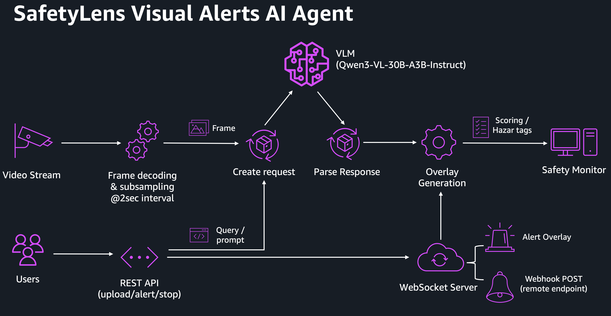

# 🔍 SafetyLens v2

**Warehouse Safety Visual Alerts Agent** — powered by Qwen3-VL deployed on Amazon EKS Hybrid Nodes (NVIDIA DGX Spark).

A VLM-based AI agent that continuously monitors warehouse video feeds and static camera images for safety hazards, providing real-time scoring, hazard detection, alerting, and natural language querying.

## Features

- **Continuous Video Monitoring** — Upload video files or connect RTSP streams; frames are sampled every 2 seconds for VLM analysis
- **3x Static Camera Feeds** — Manual image upload with instant safety scoring (similar to a multi-camera CCTV dashboard)
- **Safety Scoring (0–100)** — Structured JSON output with categorised hazard deductions:
  - PPE Violation (-10)
  - Blocked Exit / Fire Hazard (-30)
  - Stacking / Load Safety (-25)
  - Trip Hazard (-20)
  - Forklift Hazard (-15)
  - Spill / Chemical Hazard (-35)
- **Visual Alert System** — Configurable score threshold with flashing on-screen alert, audio notification, and optional webhook POST to external services
- **Natural Language Safety Query** — Ask questions like *"which camera shows a fire hazard?"* or *"which feed requires immediate action?"* with markdown-formatted responses
- **Real-time WebSocket Streaming** — Live video frames + VLM analysis results pushed to the browser at 15fps

## Architecture



## Prerequisites

- **NVIDIA DGX Spark** (or OEM variants) with GB10 GPU, 128GB unified memory
- **Amazon EKS Cluster with Hybrid Nodes enabled** with the DGX Spark registered as a hybrid node
  - See AWS Blog: [Deploy production generative AI at the edge using Amazon EKS Hybrid Nodes with NVIDIA DGX](https://aws.amazon.com/blogs/containers/deploy-production-generative-ai-at-the-edge-using-amazon-eks-hybrid-nodes-with-nvidia-dgx) 
- **vLLM image** optimised for DGX Spark SM 12.1a (e.g., [eugr/spark-vllm-docker](https://github.com/eugr/spark-vllm-docker) with `--tf5`)
- **Qwen3-VL-30B-A3B-Instruct model** — either [NVFP4](https://huggingface.co/ig1/Qwen3-VL-30B-A3B-Instruct-NVFP4) or [AWQ](https://huggingface.co/QuantTrio/Qwen3-VL-30B-A3B-Instruct-AWQ)
- **Cilium CNI** with BGP LoadBalancer for on-prem service access

## Deployment

### 1. Deploy the VLM backend

```bash
kubectl apply -f qwen3vl-30b-nvfp4.yaml
```

This deploys vLLM serving the Qwen3-VL-30B-A3B-Instruct NVFP4 model with Marlin backend optimisations. The model downloads automatically on first run via the HuggingFace cache hostPath volume.

Key environment variables for NVFP4 + Marlin:
```yaml
env:
- name: VLLM_TEST_FORCE_FP8_MARLIN
  value: "1"
- name: VLLM_NVFP4_GEMM_BACKEND
  value: "marlin"
- name: VLLM_USE_FLASHINFER_MOE_FP4
  value: "0"
- name: PYTORCH_CUDA_ALLOC_CONF
  value: "expandable_segments:True"
```

### 2. Deploy SafetyLens v2

```bash
kubectl apply -f safetylensv2-k8s.yaml
```

The app container image is available at:
- **Docker Hub**: `schen13912/safetylens_v2:latest`
- **Docker Hub**: `schen13912/spark-vllm:latest`

### 3. Access the app

The service is exposed via Cilium BGP LoadBalancer. Access it at the assigned external IP on port 80.

## Building from Source

```bash
# On an ARM64 build host (or using buildx for cross-compilation)
docker buildx build --platform linux/arm64 --push \
  -t <your-registry>/safetylens_v2:latest .

# Build the vLLM image on Spark and import into containerd for K8s
git clone https://github.com/eugr/spark-vllm-docker.git                  
cd spark-vllm-docker
./build-and-copy.sh -t vllm-node-tf5 --tf5
docker save vllm-node-tf5:latest | sudo ctr -n k8s.io images import -
```

## Configuration

| Environment Variable | Default | Description |
|---|---|---|
| `VLLM_URL` | `http://qwen3vl-30b-nvfp4:8000/v1` | vLLM API endpoint |
| `MODEL_NAME` | `Qwen3-VL-30B-A3B-Instruct-NVFP4` | Served model name |
| `FRAME_INTERVAL` | `2.0` | Seconds between VLM frame analyses |

## Performance

Benchmarked on NVIDIA DGX Spark (GB10, 128GB unified LPDDR5X):

| Metric | Value |
|---|---|
| Text generation | ~78 tok/s |
| Image + text (VLM) | ~60–75 tok/s |
| Tokens per safety analysis | ~44 |
| Time per frame analysis | < 2 seconds |
| KV cache capacity (FP8) | 1.6M tokens |
| Max context window | 128K tokens |

## VLM Stack

| Component | Version / Detail |
|---|---|
| vLLM | 0.17.1rc1 (eugr/spark-vllm-docker, `--tf5`) |
| PyTorch | 2.10.0a0 + CUDA 13.0 |
| Transformers | 5.3.0 |
| FlashInfer | Compiled for SM 12.1a |
| Model | Qwen3-VL-30B-A3B-Instruct-NVFP4 (MoE, 3B active) |
| Quantisation | NVFP4 weights + FP8 KV cache |
| Backend | Marlin (dense + MoE GEMM) |
| Attention | FlashInfer |

## Inspired By

- [NVIDIA Metropolis VLM Alerts](https://github.com/NVIDIA/metropolis-nim-workflows/tree/main/nim_workflows/vlm_alerts) — streaming video + VLM alert architecture
- [eugr/spark-vllm-docker](https://github.com/eugr/spark-vllm-docker) — community vLLM build for DGX Spark
- [Avarok/dgx-vllm](https://github.com/Avarok-Cybersecurity/dgx-vllm) — NVFP4 Marlin backend research

## License

MIT
