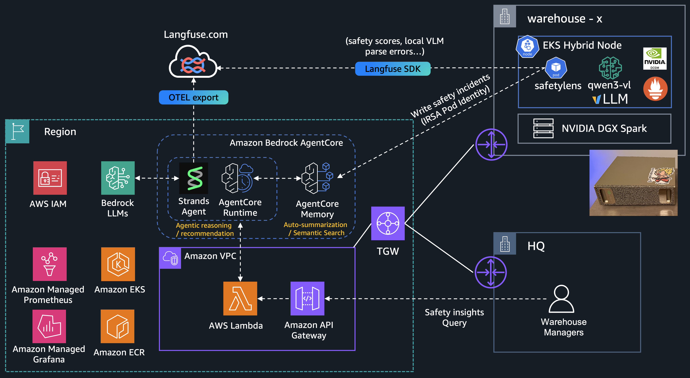
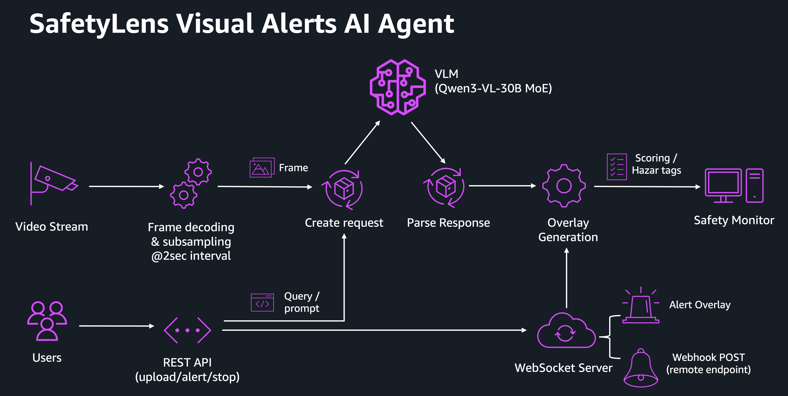

# 🔍 SafetyLens v2

**Warehouse Safety Visual Alerts Agent** — powered by Qwen3.6-35B-A3B-NVFP4 deployed on Amazon EKS Hybrid Nodes (NVIDIA DGX Spark).

A VLM-based AI agent that continuously monitors warehouse video feeds and static camera images for safety hazards, providing real-time scoring, hazard detection, alerting, and natural language querying.


# ⚡ June 2026 Update — Qwen3.6-35B Upgrade, Model-Independent Scoring & 24×7 Hardening

SafetyLens v2 moves to a newer, faster vision model and gets a major reliability pass: deterministic scoring, native-resolution analysis and non-blocking observability that makes it stable for continuous 24×7 monitoring.

## What's New

- **Model upgrade → `nvidia/Qwen3.6-35B-A3B-NVFP4`** — NVIDIA's NVFP4 release of Qwen3.6-35B-A3B (35B total / 3B active MoE, hybrid linear-attention). Served with NVIDIA's official DGX Spark recipe: **Marlin** NVFP4 MoE + **FlashInfer** + **MTP speculative decoding**, on a freshly built vLLM image (latest nightly + **FlashInfer 0.6.8/0.6.12** + transformers v5).
- **Instruct-mode by default** — thinking/reasoning disabled at the **server level** via a custom chat template, so every request returns clean JSON with no reasoning preamble (fast, deterministic). No app changes required.
- **Faster inference** — text generation **~96 tok/s** (was ~78, +23%) and VLM decode **~105 tok/s** (was ~60–75) thanks to MTP. Context window up to **262K** (was 128K).
- **Native-resolution analysis (HD/4K-ready)** — frames are now sent to the VLM at **native resolution** instead of being downscaled to 336×336. This was essential: fine hazards (e.g. **fire/electrical**) are invisible at 336px and only detected at full resolution. Works with any camera resolution automatically.
- **Deterministic, model-independent scoring** — the score is now computed **in code** from the hazard *types* the model detects, not the model's self-reported number (which drifts between models and can't be trusted for arithmetic). Swapping the VLM no longer changes the scoring scale.
- **Revised hazard rubric + severity bands** (see below) — additive deductions, with **Spill/Chemical** and **Fire/Electrical** always escalated to DANGER, and additional hazards pushing the score lower (more severe).
- **Compact-JSON prompt** — ~**3× faster per frame** (output dropped from ~160 to ~25–60 tokens) with identical scoring.
- **Non-blocking observability** — AgentCore Memory writes moved off the analysis critical path (background worker), and the per-frame Langfuse flush removed; event timestamps are captured at analysis time so they stay accurate even though delivery is async.
- **24×7 memory stability** — the live-frame broadcast uses a latest-frame-only design (stale frames are dropped) with a separate reliable event queue, so app memory stays **bounded regardless of resolution** (plateaus ~150–190 MB) — enabling continuous native-resolution monitoring.
- **Unified-memory tuning** — `gpu-memory-utilization` lowered to **0.70** (+ `--max-num-seqs 2`) so native-resolution prefills don't exhaust the GB10's shared 128 GB. KV cache is still ~3.7M tokens (≈56× headroom).

## Updated Safety Scoring

| Hazard category | Deduction | Severity |
|---|---|---|
| PPE Violation | −10 | minor |
| Forklift Hazard | −15 | minor |
| Trip Hazard | −20 | minor |
| Stacking / Load Safety | −25 | moderate |
| Blocked Fire / Emergency Exit | −35 | moderate |
| **Spill / Chemical Hazard** | **−50** | **major → DANGER** |
| **Fire / Electrical Hazard** | **−65** | **major → DANGER** |

`score = max(0, 100 − Σ deductions)` (each category counted once). Any **major** hazard forces the score into the DANGER band (≤35); additional hazards push it lower (e.g. Fire + Forklift = 20). Bands: 🟢 SAFE ≥ 70, 🟡 WARNING 40–69, 🔴 DANGER < 40.

## Performance (Qwen3.6-35B-A3B-NVFP4 on DGX Spark GB10)

| Metric | v1 (Qwen3-VL-30B) | June (Qwen3.6-35B) |
|---|---|---|
| Text generation | ~78 tok/s | **~96 tok/s** |
| Image + text (VLM) decode | ~60–75 tok/s | **~105 tok/s** |
| Per-frame analysis (native res) | < 2 s | **~0.5–0.8 s** |
| Tokens per safety analysis | ~44 | ~25–60 (compact) |
| Max context window | 128K | **262K** |
| Frame input resolution | 336×336 | **native (HD/4K)** |


# 🧠 May 2026 Update — Amazon Bedrock AgentCore Integration with Langfuse Observability

SafetyLens v2 now integrates with **Amazon Bedrock AgentCore** for intelligent incident memory, conversational safety insights, and full-stack observability via **Langfuse**.

## What's New

- **AgentCore Memory** — Every VLM safety analysis is stored as an event in AgentCore Memory with auto-summarization. Incidents are consolidated into searchable topics automatically.
- **Safety Insights Agent** — A Strands-based AI agent (Claude Haiku 4.5) deployed on AgentCore Runtime answers natural language questions about historical incidents: *"What hazards were detected today?"*, *"Which incidents had the lowest scores?"*
- **Langfuse Observability** — Dual observability pipeline:
  - SafetyLens → Langfuse: VLM safety-score distribution, parse error tracking, model performance
  - AgentCore → Langfuse: Agent query traces via OTEL (latency, tokens, cost)
- **Private Web Portal** — Lambda-based chat UI accessible via Private API Gateway (VPN-only) for warehouse managers to query incident history
- **IRSA Authentication** — Pod-level IAM via EKS Service Account for secure AWS API access without static credentials

## Hybrid AI Architecture (with AgentCore Integration)





## Additional Prerequisites (AgentCore)

- AWS account with Bedrock AgentCore access (ap-southeast-2)
- Bedrock model access: Claude Haiku 4.5 (`au.anthropic.claude-haiku-4-5-20251001-v1:0`)
- [Langfuse Cloud](https://us.cloud.langfuse.com) account (free tier)
- Python 3.12+ with `bedrock-agentcore`, `strands-agents`, `langfuse` packages
- `agentcore` CLI (`pip install bedrock-agentcore-starter-toolkit`)

## AgentCore Deployment

### 1. Create AgentCore Memory

AgentCore Memory uses a **Summary Memory Strategy** that automatically consolidates incoming events into searchable topic summaries. Unlike a traditional database where you query raw records, the summary strategy uses AI to:

- **Extract** key information from each safety event as it arrives
- **Consolidate** similar events into structured topic summaries over time (~30-40s processing)
- **Enable semantic search** over the consolidated summaries for natural language queries

This means the agent gets pre-digested, accurate aggregate data rather than searching through thousands of individual raw records.

```bash
cd safetylens_agentcore/
source .venv/bin/activate
python3 setup_memory.py
# Output: Memory ID = SafetyLens_Memory-XXXXXXXXXX
```

### 2. Configure IRSA (Pod Identity)

The SafetyLens pod needs AWS credentials to write events to AgentCore Memory. IRSA (IAM Roles for Service Accounts) provides pod-level IAM access without static credentials.

```bash
# Get your cluster OIDC ID
OIDC_ID=$(aws eks describe-cluster --name <cluster-name> \
  --query 'cluster.identity.oidc.issuer' --output text | cut -d'/' -f5)
ACCOUNT=$(aws sts get-caller-identity --query 'Account' --output text)
REGION=ap-southeast-2

# Create trust policy
cat > trust-policy.json << 'POLICY'
{
  "Version": "2012-10-17",
  "Statement": [{
    "Effect": "Allow",
    "Principal": {"Federated": "arn:aws:iam::${ACCOUNT}:oidc-provider/oidc.eks.${REGION}.amazonaws.com/id/${OIDC_ID}"},
    "Action": "sts:AssumeRoleWithWebIdentity",
    "Condition": {"StringEquals": {
      "oidc.eks.${REGION}.amazonaws.com/id/${OIDC_ID}:sub": "system:serviceaccount:default:safetylens-v2-sa",
      "oidc.eks.${REGION}.amazonaws.com/id/${OIDC_ID}:aud": "sts.amazonaws.com"
    }}
  }]
}
POLICY

# Create IAM role
aws iam create-role --role-name safetylens-v2-irsa-role \
  --assume-role-policy-document file://trust-policy.json

# Attach AgentCore Memory permissions
aws iam put-role-policy --role-name safetylens-v2-irsa-role \
  --policy-name AgentCoreMemoryAccess \
  --policy-document '{"Version":"2012-10-17","Statement":[{"Effect":"Allow","Action":["bedrock-agentcore:*"],"Resource":"arn:aws:bedrock-agentcore:<REGION>:<ACCOUNT>:memory/<MEMORY_ID>"}]}'

# Create and annotate Kubernetes service account
kubectl create serviceaccount safetylens-v2-sa
kubectl annotate serviceaccount safetylens-v2-sa \
  eks.amazonaws.com/role-arn=arn:aws:iam::<ACCOUNT>:role/safetylens-v2-irsa-role
```

### 3. Deploy SafetyLens with AgentCore integration

```bash
kubectl apply -f safetylensv2-agentcore-k8s.yaml
```

The updated `safetylensv2-agentcore-k8s.yaml` includes:
- `serviceAccountName: safetylens-v2-sa` for IRSA credentials
- Environment variables for Langfuse keys, Memory ID, and AWS region

> **Note:** If Langfuse/Memory env vars are not set, the app runs normally without AgentCore integration — all features are opt-in.

### 4. Deploy the Safety Insights Agent

```bash
cd safetylens_agentcore/agent/

agentcore configure -e agent.py -n safetylens_insights -rf requirements.txt \
  -r ap-southeast-2 -dt direct_code_deploy -rt PYTHON_3_12 -do -ni

LANGFUSE_AUTH=$(echo -n '<public-key>:<secret-key>' | base64 -w0)

agentcore deploy \
  --env MEMORY_ID=<your-memory-id> \
  --env AWS_DEFAULT_REGION=ap-southeast-2 \
  --env OTEL_EXPORTER_OTLP_ENDPOINT=https://us.cloud.langfuse.com/api/public/otel \
  --env "OTEL_EXPORTER_OTLP_HEADERS=Authorization=Basic ${LANGFUSE_AUTH}" \
  --env DISABLE_ADOT_OBSERVABILITY=true
```

Test the agent:
```bash
agentcore invoke '{"prompt": "What safety incidents have been detected today?"}'
```

### 5. Deploy Private Web Portal (Optional)

A Lambda-based chat UI for warehouse managers to query incident history, accessible only via VPN through a Private API Gateway.

```bash
# Create VPC Endpoint for AgentCore (PrivateLink)
aws ec2 create-vpc-endpoint \
  --vpc-id <vpc-id> \
  --vpc-endpoint-type Interface \
  --service-name com.amazonaws.ap-southeast-2.bedrock-agentcore \
  --subnet-ids <private-subnet-a> <private-subnet-b> \
  --security-group-ids <sg-id> \
  --private-dns-enabled

# Create VPC Endpoint for Private API Gateway
aws ec2 create-vpc-endpoint \
  --vpc-id <vpc-id> \
  --vpc-endpoint-type Interface \
  --service-name com.amazonaws.ap-southeast-2.execute-api \
  --subnet-ids <private-subnet-a> <private-subnet-b> \
  --security-group-ids <sg-id> \
  --private-dns-enabled

# Deploy Lambda (in private subnets)
cd safetylens_agentcore/lambda/
zip -j function.zip lambda_function.py

aws lambda create-function \
  --function-name safetylens-insights \
  --runtime python3.12 \
  --handler lambda_function.lambda_handler \
  --role <lambda-role-arn> \
  --zip-file fileb://function.zip \
  --timeout 90 \
  --vpc-config SubnetIds=<private-subnet-a>,<private-subnet-b>,SecurityGroupIds=<sg-id> \
  --environment "Variables={AGENT_RUNTIME_ARN=<agent-arn>}"

# Create Private REST API Gateway
aws apigateway create-rest-api \
  --name safetylens-insights-private \
  --endpoint-configuration '{"types":["PRIVATE"],"vpcEndpointIds":["<execute-api-vpce-id>"]}' \
  --policy '{"Version":"2012-10-17","Statement":[{"Effect":"Allow","Principal":"*","Action":"execute-api:Invoke","Resource":"*","Condition":{"StringEquals":{"aws:sourceVpce":"<execute-api-vpce-id>"}}}]}'
```

Access the portal via VPN at: `https://<api-id>.execute-api.ap-southeast-2.amazonaws.com/prod/`


## Additional Configuration (AgentCore)

| Environment Variable | Description |
|---|---|
| `LANGFUSE_SECRET_KEY` | Langfuse secret key |
| `LANGFUSE_PUBLIC_KEY` | Langfuse public key |
| `LANGFUSE_BASE_URL` | `https://us.cloud.langfuse.com` |
| `MEMORY_ID` | AgentCore Memory resource ID |
| `AWS_DEFAULT_REGION` | `ap-southeast-2` |

## AWS Resources Created

| Resource | Purpose |
|---|---|
| AgentCore Memory (`SafetyLens_Memory-*`) | Incident storage with summary strategy |
| AgentCore Runtime (`safetylens_insights-*`) | Strands agent hosting (Claude Haiku 4.5) |
| Lambda (`safetylens-insights`) | Chat web portal (private VPC) |
| Private API Gateway (`<api-gateway-id>`) | VPN-accessible endpoint for warehouse managers |
| VPC Endpoint (bedrock-agentcore) | PrivateLink for Lambda → AgentCore |
| VPC Endpoint (execute-api) | Private API Gateway access |
| IAM Role (safetylens-v2-irsa-role) | IRSA for pod-level AWS access |
| IAM Role (safetylens-insights-lambda-role) | Lambda execution + AgentCore invoke |

## References

- [Amazon Bedrock AgentCore Observability with Langfuse](https://aws.amazon.com/blogs/machine-learning/amazon-bedrock-agentcore-observability-with-langfuse/) — AWS Blog
- [AgentCore Samples: EKS-hosted Agent Observability](https://github.com/awslabs/amazon-bedrock-agentcore-samples/tree/main/01-tutorials/06-AgentCore-observability/06-Agentcore-observability-for-eks-hosted-agent)
- [Strands Agents SDK](https://github.com/strands-agents/sdk-python)

---

## Features

- **Continuous Video Monitoring** — Upload video files or connect RTSP streams; frames are sampled every 1 second at native resolution (HD/4K) for VLM analysis
- **3x Static Camera Feeds** — Manual image upload with instant safety scoring (similar to a multi-camera CCTV dashboard)
- **Safety Scoring (0–100)** — Deterministic, model-independent scoring computed in code from detected hazard types:
  - PPE Violation (-10)
  - Forklift Hazard (-15)
  - Trip Hazard (-20)
  - Stacking / Load Safety (-25)
  - Blocked Fire / Emergency Exit (-35)
  - Spill / Chemical Hazard (-50) → DANGER
  - Fire / Electrical Hazard (-65) → DANGER
- **Visual Alert System** — Configurable score threshold with flashing on-screen alert, audio notification, and optional webhook POST to external services
- **Natural Language Safety Query** — Ask questions like *"which camera shows a fire hazard?"* or *"which feed requires immediate action?"* with markdown-formatted responses
- **Real-time WebSocket Streaming** — Live video frames + VLM analysis results pushed to the browser at near real-time

## Architecture




## Prerequisites

- **NVIDIA DGX Spark** (or OEM variants) with GB10 GPU, 128GB unified memory
- **Amazon EKS Cluster with Hybrid Nodes enabled** with the DGX Spark registered as a hybrid node
  - See AWS Blog: [Deploy production generative AI at the edge using Amazon EKS Hybrid Nodes with NVIDIA DGX](https://aws.amazon.com/blogs/containers/deploy-production-generative-ai-at-the-edge-using-amazon-eks-hybrid-nodes-with-nvidia-dgx) 
- **vLLM image** optimised for DGX Spark SM 12.1a (e.g., [eugr/spark-vllm-docker](https://github.com/eugr/spark-vllm-docker) with `--tf5`)
- **Qwen3.6-35B-A3B-NVFP4 model** — NVIDIA's NVFP4 MoE release ([nvidia/Qwen3.6-35B-A3B-NVFP4](https://huggingface.co/nvidia/Qwen3.6-35B-A3B-NVFP4))
- **Cilium CNI** with BGP LoadBalancer for on-prem service access

## Deployment

### 1. Deploy the VLM backend

```bash
kubectl apply -f qwen36-35b-nvfp4.yaml
```

This deploys vLLM serving the Qwen3.6-35B-A3B-NVFP4 model with **Marlin** NVFP4 MoE backend + **FlashInfer** + **MTP speculative decoding**. The model is loaded from the HuggingFace cache hostPath on the Spark's NVMe (the deployment runs with `HF_HUB_OFFLINE=1`, so pre-cache the model there first).

Key environment variables for NVFP4 + Marlin:
```yaml
env:
- name: VLLM_USE_FLASHINFER_MOE_FP4
  value: "0"
- name: VLLM_FP8_MOE_BACKEND
  value: "flashinfer_cutlass"
- name: FLASHINFER_DISABLE_VERSION_CHECK
  value: "1"
- name: CUTE_DSL_ARCH
  value: "sm_121a"
- name: VLLM_MARLIN_USE_ATOMIC_ADD
  value: "1"
- name: PYTORCH_CUDA_ALLOC_CONF
  value: "expandable_segments:True"
```

### 2. Deploy SafetyLens v2

```bash
kubectl apply -f safetylensv2-agentcore-k8s.yaml
```

The app container image is available at:
- **Docker Hub**: [schen13912/safetylens_v2:latest](https://hub.docker.com/r/schen13912/safetylens_v2)
- **Docker Hub**: [schen13912/spark-vllm:latest](https://hub.docker.com/r/schen13912/spark-vllm)

### 3. Access the app

The service is exposed via Cilium BGP LoadBalancer. Access it at the assigned external IP on port 80.

## Building from Source

```bash
# On an ARM64 build host (or using buildx for cross-compilation)
docker buildx build --platform linux/arm64 --push \
  -t <your-registry>/safetylens_v2:latest .

# Build the vLLM image on Spark and import into containerd for K8s
git clone https://github.com/eugr/spark-vllm-docker.git                  
cd spark-vllm-docker
./build-and-copy.sh -t vllm-node-tf5 --tf5
docker save vllm-node-tf5:latest | sudo ctr -n k8s.io images import -
```

## Configuration

| Environment Variable | Default | Description |
|---|---|---|
| `VLLM_URL` | `http://qwen36-35b-nvfp4:8000/v1` | vLLM API endpoint |
| `MODEL_NAME` | `Qwen3.6-35B-A3B-NVFP4` | Served model name |
| `FRAME_INTERVAL` | `1.0` | Seconds between VLM frame analyses |

## Performance

Benchmarked on NVIDIA DGX Spark (GB10, 128GB unified LPDDR5X):

| Metric | Value |
|---|---|
| Text generation | ~96 tok/s |
| Image + text (VLM) | ~105 tok/s |
| Tokens per safety analysis | ~25–60 (compact) |
| Time per frame analysis | ~0.5–0.8 s (native resolution) |
| KV cache capacity (FP8) | ~3.7M tokens (@ 64K) |
| Max context window | 262K tokens |
| Frame input resolution | native (HD/4K) |

## VLM Stack

| Component | Version / Detail |
|---|---|
| vLLM | 0.22.1rc1 nightly (eugr/spark-vllm-docker, `--tf5`) |
| PyTorch | 2.x + CUDA 13.0 |
| Transformers | v5 |
| FlashInfer | 0.6.12 (SM 12.1a) |
| Model | Qwen3.6-35B-A3B-NVFP4 (MoE, 3B active) |
| Quantisation | NVFP4 weights + FP8 KV cache |
| Backend | Marlin (NVFP4 MoE) + MTP speculative decoding |
| Attention | FlashInfer |

## Inspired By

- [NVIDIA Metropolis VLM Alerts](https://github.com/NVIDIA/metropolis-nim-workflows/tree/main/nim_workflows/vlm_alerts) — streaming video + VLM alert architecture
- [eugr/spark-vllm-docker](https://github.com/eugr/spark-vllm-docker) — community vLLM build for DGX Spark
- [Avarok/dgx-vllm](https://github.com/Avarok-Cybersecurity/dgx-vllm) — NVFP4 Marlin backend research

## License

MIT
